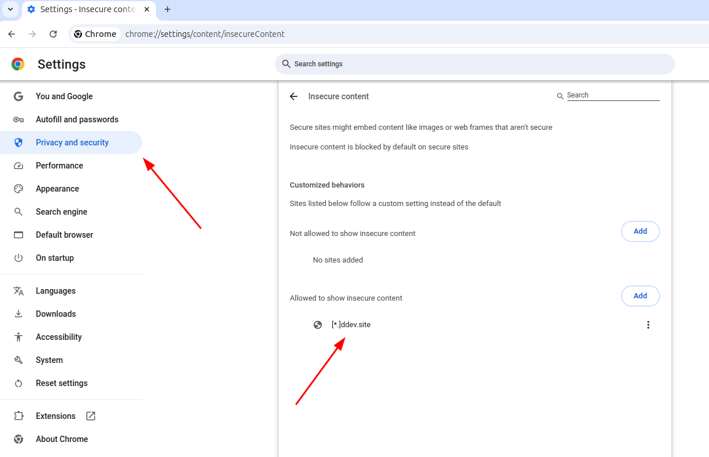

# Storefront and Admin Watchers with ddev

I have successfully tested the admin and storefront watchers with ddev in apache-fpm and nginx-fpm mode up to Shopware versions 6.6.7.1, 6.6.10.4 and 6.7.4.2 to 6.7.7.1. Please note that the Storefront Watcher is not compatible with ddev in Shopware versions 6.6.8.0 to 6.6.8.2.

Please also note that Shopware's watcher implementations, as of version 6.7.4.2, still seem somewhat immature to me, so exercise caution when following the instructions provided here. I have not verified the use of watchers with versions 6.7.1 to 6.7.3. **I strongly recommend using the watchers provided with Shopware CLI** (I haven't tested the ones provided by Shopware with 6.7.4.2 or later).

### Using the Watchers with 6.7.4.2 and above

#### Expose Ports

Add the file `.ddev/config.watcher.yaml` with the following contents:

```yaml
web_environment:
  - HOST=0.0.0.0
  - PROXY_URL=${DDEV_PRIMARY_URL}:9998
  - STOREFRONT_SKIP_SSL_CERT=true
web_extra_exposed_ports:
  - name: vite-admin
    container_port: 5173
    http_port: 5172
    https_port: 5173
  - name: storefront-proxy
    container_port: 9998
    http_port: 8888
    https_port: 9998
  - name: storefront-assets
    container_port: 9999
    http_port: 8889
    https_port: 9999
```

#### Admin Watcher

The current version of the Shopware admin watcher is practically unusable with ddev because it dynamically adds a port for each of your plugins. To avoid this problem, use the standalone Admin Watcher provided with Shopware CLI (see here for details). Start the standalone watcher with this command:

```bash
shopware-cli extension admin-watch custom/static-plugins/<your-plugin>/ \
https://<project>.ddev.site \
--listen :5173 \
--external-url https://<project>.ddev.site:5173
```

Or you may want to add a custom ddev command for this. To do so, add a file `.ddev/commands/web/admin-watch` with this contents:

```bash
#!/usr/bin/env bash

## Description: Run admin watcher for a plugin. Note only works for plugins in custom/static-plugins.
## Usage: admin-watch <pluginName>

set -e

if [ -z "$1" ]; then
  echo -e "Verwendung: ddev admin-watch <plugin-name>\n"
  exit 1
else
  PLUGIN_NAME="$1"
fi

PLUGIN_DIR="custom/static-plugins/${PLUGIN_NAME}"

if [ ! -d "$PLUGIN_DIR" ]; then
  echo "Error: Plugin directory '${PLUGIN_DIR}' does not exist."
  exit 1
fi

if [ ! -f "$PLUGIN_DIR/composer.json" ]; then
  echo "Error: No composer.json found in '${PLUGIN_DIR}'."
  exit 1
fi

shopware-cli extension admin-watch ${PLUGIN_DIR}/ \
https://${DDEV_HOSTNAME} \
--listen :5173 \
--external-url https://${DDEV_HOSTNAME}:5173

```

Simply run this from your terminal with `ddev admin-watch <plugin-name>` and open the provided URL.

#### Storefront Watcher

Start the storefront watcher with this command

```bash
shopware-cli project storefront-watch
```

### For 6.7.0.0 or earlier see the following sections

First of all, create a file `.ddev/config.watcher.yaml` with the following content (note this is for 6.7.0.0, see below for a slightly different file for 6.5 and 6.6).

```yaml
# .ddev/config.watcher.yaml for 6.7.0.0 and above
web_environment:
    - HOST=0.0.0.0
    - ADMIN_PORT=9997
    - PROXY_URL=${DDEV_PRIMARY_URL}:9998
    - STOREFRONT_SKIP_SSL_CERT=true
web_extra_exposed_ports:
    - name: admin-proxy
      container_port: 9997
      http_port: 8887
      https_port: 9997
    - name: storefront-proxy
      container_port: 9998
      http_port: 8888
      https_port: 9998
    - name: storefront-assets
      container_port: 9999
      http_port: 8889
      https_port: 9999
```

For 6.5 and 6.6, your `.ddev/config.watcher.yaml` should look like this:

```yaml
# .ddev/config.watcher.yaml (Shopware 6.5 and 6.6)
web_environment:
    - HOST=0.0.0.0
    - PORT=9997
    - DISABLE_ADMIN_COMPILATION_TYPECHECK=1
    - PROXY_URL=${DDEV_PRIMARY_URL}:9998
    - STOREFRONT_SKIP_SSL_CERT=true
web_extra_exposed_ports:
    - name: admin-proxy
      container_port: 9997
      http_port: 8887
      https_port: 9997
    - name: storefront-proxy
      container_port: 9998
      http_port: 8888
      https_port: 9998
    - name: storefront-assets
      container_port: 9999
      http_port: 8889
      https_port: 9999
```

These directives tell the ddev router which additional ports to route to the container for the watchers. The web\_environment directive adds the extra HOST and ADMIN\_PORT environment variables required by the admin watcher hot proxy. The PROXY\_URL and STOREFRONT\_SKIP\_SSL\_CERT directives are required by the storefront hot-reload watcher. Note that PROXY\_URL requires the port to be specified explicitly.

Note: DISABLE\_ADMIN\_COMPILATION\_TYPECHECK=1 is the default in newer Shopware versions (from about 6.6.7.0). So it's possible to omit it in this case.

Don't forget to restart your project with `ddev restart`.

#### Admin Watcher

Start the admin watcher with `bin/watch-administration.sh` (production template) or `composer run watch:admin` (contribution template).

To reach the admin watcher, point your browser to `https://<my-project>.ddev.site:9997` (omit the /admin slug!). You must use your primary ddev url - using localhost or a docker IP address (like 172.19.0.2) will not work.

If you have any custom or third party plugins that supply admin components (like SwagPayPal), you will note, in your browser's console, a number of "mixed content" errors, as the watcher attemps to load plugin assets via http and native IPs. To avoid these errors, you need to configure your browser to allow to show insecure content. If you use the Chrome browser or a similar one, point your browser to `chrome://settings/content/insecureContent` and add your ddev sites `[*.]ddev.site` to the list of allowed sites.

<div data-full-width="false"><figure><figcaption><p>Screenshot of Chrome settings to allow insecure content for selected sites</p></figcaption></figure></div>

#### Storefront Watcher

Start the storefront watcher with `bin/watch-storefront.sh` (production template) or `composer run watch:storefront` (contribution template).

To reach the storefront watcher point your browser to `https://<my-project>.ddev.site:9998`.

#### Media Requests with HTTP and the (blocked:mixed-content) Error

**The following applies to all versions prior and including Shopware 6.6.7.1 only.** Please note that Shopware has refactored the Webpack hot proxy for the storefront watcher for newer versions to ensure consistent use of the HTTPS protocol with the storefront watcher.

In the Storefront Watcher you will notice that all requests for media files are using the HTTP scheme instead of HTTPS. I don't know of a fix for this at the moment, but you can avoid the consequences with a workaround.

Firstly, you need to define a sales channel domain `http://<my-project>.ddev.site` in addition to the https domain.

Second, the media requests using HTTP instead of HTTPS will cause Chrome (and other browsers) to block them. Simply add your \*.ddev.site urls to Chrome's list of sites that are allowed to display unsafe content - see screenshot below.

To do so, point your browser to `chrome://settings/content/insecureContent` and add a site `[*.]ddev.site` to be allowed to show insecure content.

<figure><figcaption><p>Screenshot of Chrome settings to allow a site to use insecure content</p></figcaption></figure>
