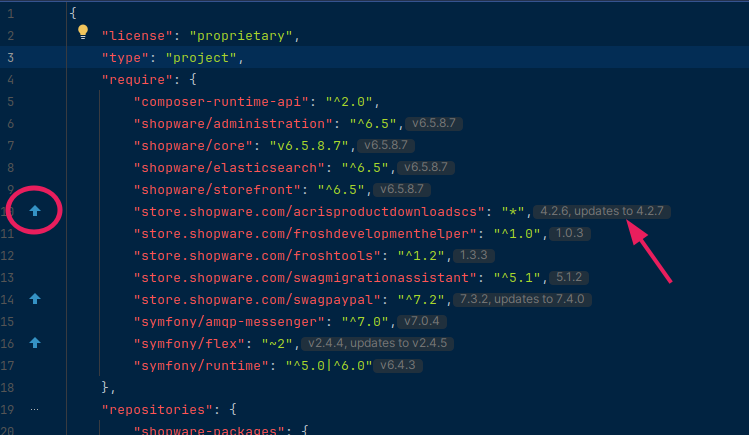

# How to Discover Available Updates?

This question is often asked: Is there an update for plugin xyz? So what do I do? Look up the version of the plugin in Admin and compare it with what is available on store.shopware.com? There is a simpler, more straightforward way.

If you are using a local setup for development, and PhpStorm with the famous Symfony plugin as your IDE, and you have installed your plugins using composer, then just have a look at the composer.json file of your project:

<figure><figcaption></figcaption></figure>

PhpStorm will indicate all plugins with available plugins, even indicating to which version a `composer update` command would update, given your defined environment (i.e. Shopware 6.4.x.x or 6.5.x.x).
