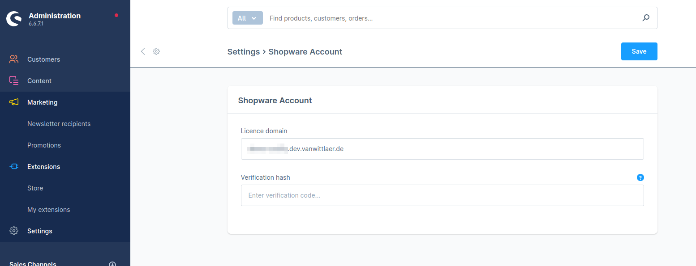
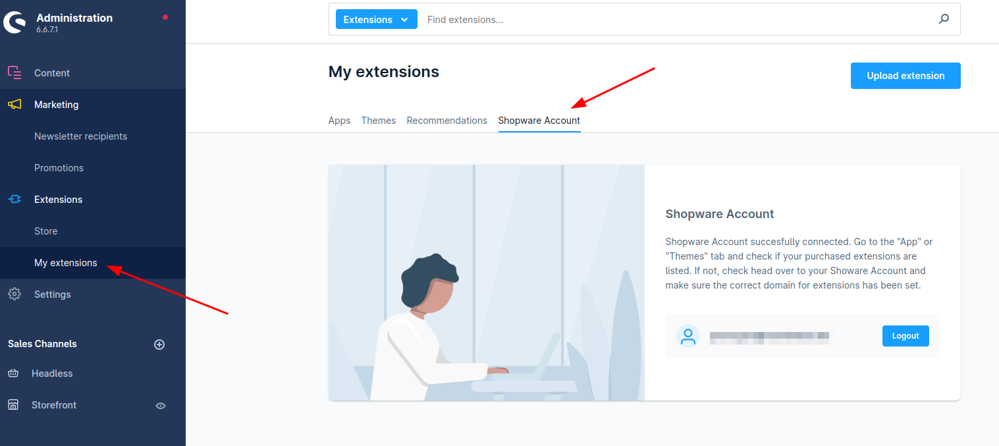

# Local Testing of Shopware Commercial Features

### Select and activate SwagCommercial for Your Wildcard Domain

To do this, log into the partner area of your Shopware account.

### Set Your Local Installation's Licence Domain

<figure><figcaption></figcaption></figure>

Note this is the wildcard licence domain you have registered with Shopware, it is different from your local domain (typically something.ddev.site).

### Connect Your Local Installation to the Shopware Account

<figure><figcaption></figcaption></figure>

### Install and Activate SwagCommercial Locally

Composer require SwagCommercial, then install and activate following the standard procedures.

```shell
composer require store.shopware.com/swagcommercial
bin/console plugin:refresh
bin/console plugin:install --activate -c SwagCommercial
```

### Ensure Scheduled Tasks Running Locally

In particular, the task `swag.commercial.update_license` needs to active - check it was last time executed after you activated the plugin, and it is in status `scheduled`.

### Be Patient

It may take some time - up to an hour or so - for your local installation to fully synchronize with Shopware's licence server. Eventually, you should see the commercial features - like warehouses management or the subscriptions - being available in the Admin. If the synchronization did fail, try to reschedule the update task (see above) or manually trigger the update from the CLI with `bin/console commercial:license:update`.

### Commercial CLI Commands

The Commercial plugin brings its own set of CLI commands:

```shell
 commercial:license:update  Update commercial license key
 commercial:license:info    Show commercial license info
 commercial:license:set     Set commercial license host & key
 commercial:feature:disable Disable a feature which is included in your plan
 commercial:feature:enable  Enable a feature which is included in your plan
 commercial:feature:list    List features included in your plan and their status
 commercial:report-turnover Reports the turnover of the specified timeframe
```

Check your licence status with `commercial:license:info`. If you miss a feature, see `commercial:feature:list` and enable or disable the features you need.

### Troubleshooting

t.b.d.
